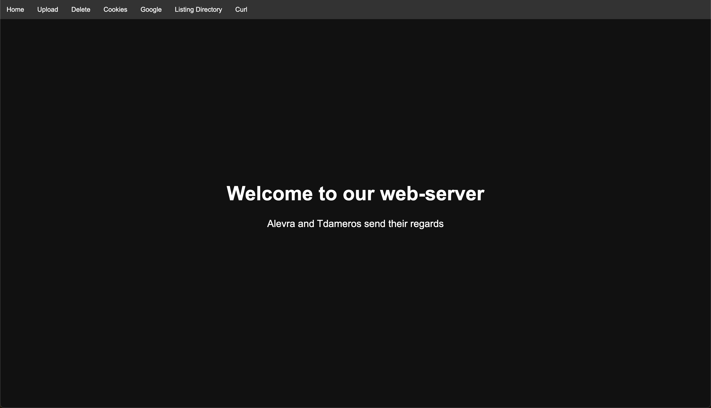

# 42 Webserv - a Nginx clone in C++

Webserv is a project from School 42 aiming to implement an HTTP server in C++
according to the specifications of the HTTP/1.1
protocol ([see RFC2616](docs/rfc2616.pdf)).

## Features

- Handling of GET, POST, DELETE requests
- Support for standard HTTP headers
- Management of virtual servers
- Support for persistent connections
- Handling of static and dynamic files
- Support for CGI (Common Gateway Interface)
- Configuration management via configuration files

## Usage

### Local

```bash
make
./webserv -l1 -c resources/webserv.conf
```

### Docker

```bash
make build_image
make run_container
```

Open the following link in your browser to access the demo
site: http://localhost:4243.

In the local version, remember to modify the paths to the Python and Bash CGI
binaries in the configuration file to avoid getting 500 errors.

### Options

```
./webserv -h                                                                                                                                            1 ↵ tdameros@Mac-hine
Webserv 1.0
Usage: webserv [options] *.conf
       webserv -c example.conf
Options:
  -h, --help                Show this help message.
  -l, --log-level=LEVEL     Set the logging level (LEVEL between 0 and 4).
                            DEBUG, INFO, WARNING, ERROR, CRITICAL
  -f, --log-file=FILE       Specify the log file (FILE).
  -c, --log-color           Enable colored logging output.
  -s, --syntax              Check the syntax of the configuration file.
```

## Screenshots



## Running Tests

The tests use Python along with Siege to conduct stress tests on the web server.

```bash
make test
```

## Documentation

- [Configuration files](docs/config_file.md)
- [RFC2616](docs/rfc2616.pdf)
